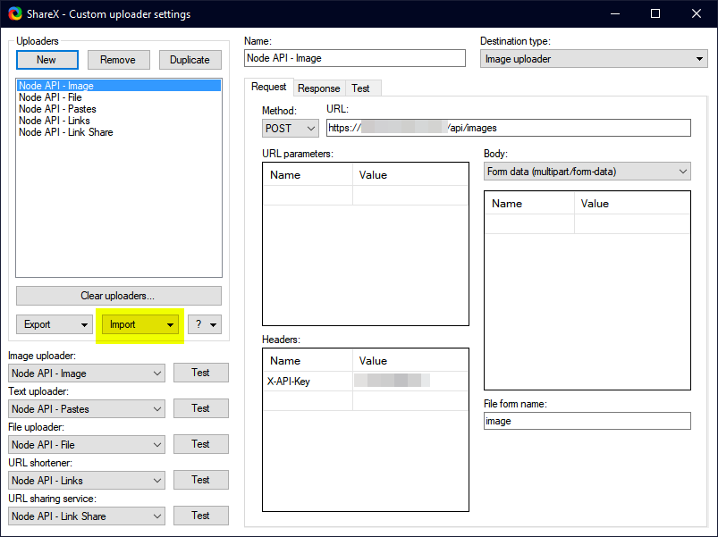

# Node TypeScript ShareX API

This is a Node.js API for ShareX. This is ideal if you want to use ShareX with your own server and domain.

[Discord](https://discord.gg/msgmdrr)

## Features

- Full ShareX feature support
- Thumbnail support
- Deletion URL support
- Syntax highlighting
- Discord Logging (optional)

## Requirements

- Node.js
- Yarn
  - You can use npm but the readme will use Yarn.
- MySQL Database
- git
  - You can place the folder there manually.
- pm2
  - If you want to run in background.

## Installation

Clone the repository.

```bash
git clone https://github.com/busheezy/node-ts-sharex-api
```

Navigate inside of the directory.

```bash
cd node-ts-sharex-api
```

Install the dependencies.

```bash
yarn
```

Build the project

```bash
yarn build
```

Run the database migration.

```bash
yarn migrate
```

Edit the config file. You can rename .env.example to .env and edit the values.

You should proxy this with nginx or apache. There is a config [here](nginx.conf).

### Edit API Config

```ini
# MySQL database auth information.
DB_NAME=sharex
DB_HOST=localhost
DB_USERNAME=sharex
DB_PASSWORD=

# This is the API Key we validate ShareX calls with.
API_KEY=hunter1

# The Discord webhook URL is for discord loggging via the ShareX "share" feature.
# It is optional.
DISCORD_WEBHOOK_URL=

# We autogenerate thumbnails. Choose how many pixels wide or tall it can be.
THUMBNAIL_SIZE=64
```

### Import ShareX configs

The ShareX configurations are [here](sxcu). You need to import these into ShareX.



Edit the request and response tab for every configuration to reflect your domain.

## Starting

### pm2

```bash
pm2 start --env production
```

or

### yarn

```bash
yarn start
```

or

### node

```bash
NODE_ENV=proudction node dist/index.js
```

## Usage

Use ShareX like normal.

## Syntax Highlighting

- Upload text
- Append forward slash and language
  - ``example.com/abcdef/javascript``

The languages are listed [here](syntax-languages.txt).

## Delete via API

Snag your delete url from ShareX. Navigate to the url. The page will give you a code. Append a trailing slash and the code it gives you to complete deletion.

- Load page
  - ``example.com/api/delete/abcd``
- Get code (the response)
- Load page with code appended.
  - ``example.com/api/delete/abcd/efgh``
- Deleted.

## Screenshots


## Contributing

Pull requests are welcome. For major changes, please open an issue first to discuss what you would like to change.

## Credits

[Ruto](https://github.com/devruto)

- Docker support

## License

[GNU GPLv3](https://choosealicense.com/licenses/gpl-3.0/)
